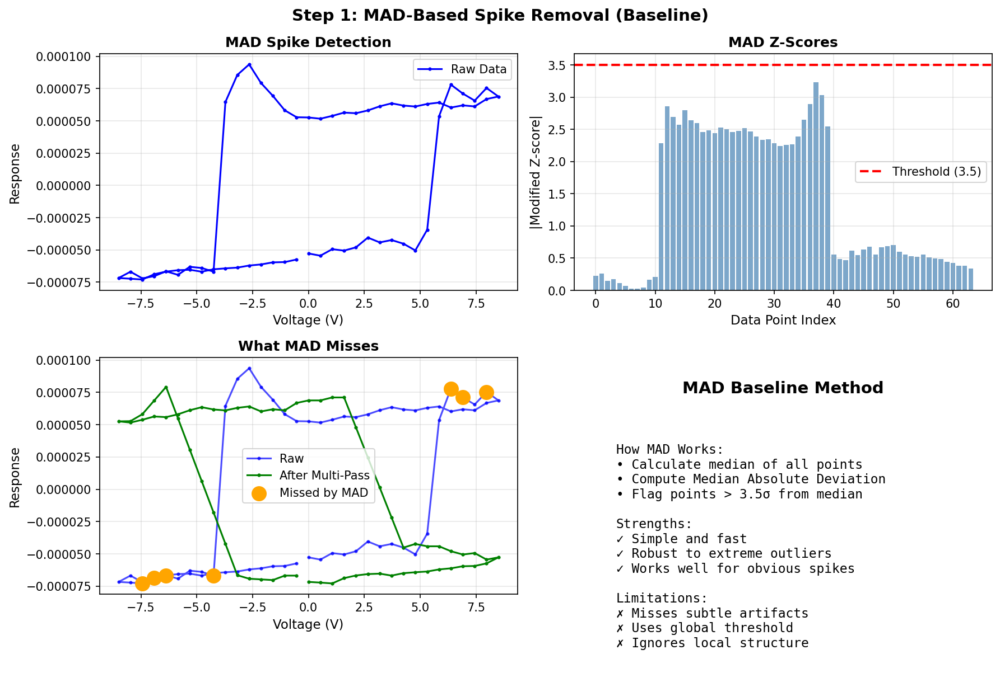
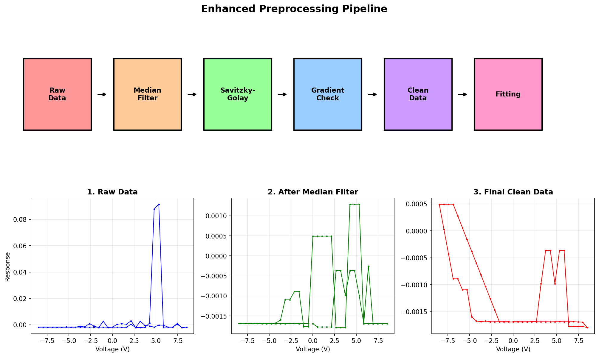
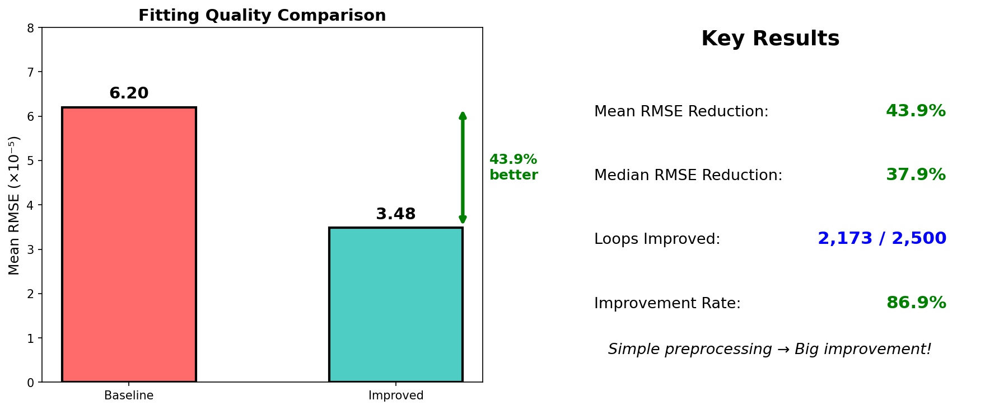
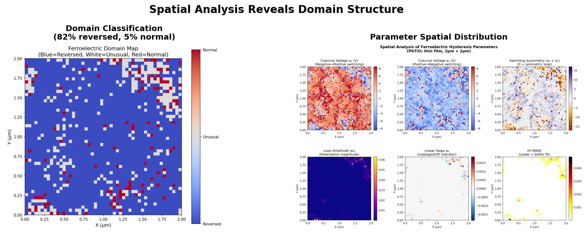

# Multi-Pass Preprocessing for Robust Hysteresis Loop Fitting

**Microscopy Hackathon 2025**

A preprocessing pipeline for fitting hysteresis loops from Piezoresponse Force Microscopy (PFM) data of ferroelectric materials. Achieves **43.9% improvement** in fitting accuracy.

## Installation

```bash
pip install -r requirements.txt
```

## Usage

### Run Full Pipeline

```bash
./main.sh
```

### Run Individual Steps

```bash
# Step 1: Baseline fitting with MAD preprocessing
python loopfittingproblem.py

# Step 2: Spatial analysis with parallel processing
python spatial_analysis.py

# Step 3: Improved multi-pass preprocessing
python improved_preprocessing.py
```

## Data

| Item | Description |
|------|-------------|
| Sample | PbTiO₃ thin film |
| Grid | 50 × 50 points (2,500 loops) |
| Points per loop | 64 |

Input files:
- `hysteresis_loops.npy` - Raw loop data
- `dc_vec.npy` - Voltage vector

## Methods

### Baseline: MAD Spike Removal



Simple Median Absolute Deviation with global threshold. Misses subtle artifacts.

### Improved: Multi-Pass Preprocessing



| Pass | Method | Catches |
|------|--------|---------|
| 1 | Median Filter | Extreme spikes |
| 2 | Savitzky-Golay | Subtle deviations |
| 3 | Gradient Check | Sharp discontinuities |

### Fitting

- PCA + HDBSCAN clustering
- Multi-start L-BFGS-B optimization
- 9-parameter error function model

## Results



| Metric | Baseline | Improved | Change |
|--------|----------|----------|--------|
| Mean RMSE | 6.20×10⁻⁵ | 3.48×10⁻⁵ | **-43.9%** |
| Median RMSE | 5.44×10⁻⁶ | 3.38×10⁻⁶ | -37.9% |
| Loops Improved | - | 2,173/2,500 | **86.9%** |

### Spatial Analysis



- Reversed polarity: 82%
- Normal polarity: 5%
- Unusual/mixed: 13%

## Files

| File | Description |
|------|-------------|
| `loopfittingproblem.py` | Baseline fitting |
| `spatial_analysis.py` | Parallel fitting + visualization |
| `improved_preprocessing.py` | Multi-pass preprocessing |
| `main.sh` | Pipeline script |

### Output

| File | Description |
|------|-------------|
| `result_spatial.csv` | Baseline fitting results |
| `result_combined_preproc.csv` | Improved results |
| `spatial_analysis.png` | Parameter heatmaps |
| `domain_map.png` | Domain classification |
| `histograms.png` | Parameter distributions |
| `correlations.png` | Correlation matrix |

## 9-Parameter Model

```
R(V) = (A/2) × [erf((V - Vc) / w) + 1] + offset
```

| Param | Description |
|-------|-------------|
| a0, a1 | Forward/reverse amplitude |
| a2, a3 | Coercive voltage |
| a4, a5 | Transition width |
| a6, a7 | Switching voltage |
| a8 | Offset |

## References

1. Jesse, S., et al. "Switching spectroscopy piezoresponse force microscopy." *Appl. Phys. Lett.* 88 (2006)
2. Strelcov, E., et al. "Deep data analysis of conductive phenomena." *ACS Nano* 8 (2014)
