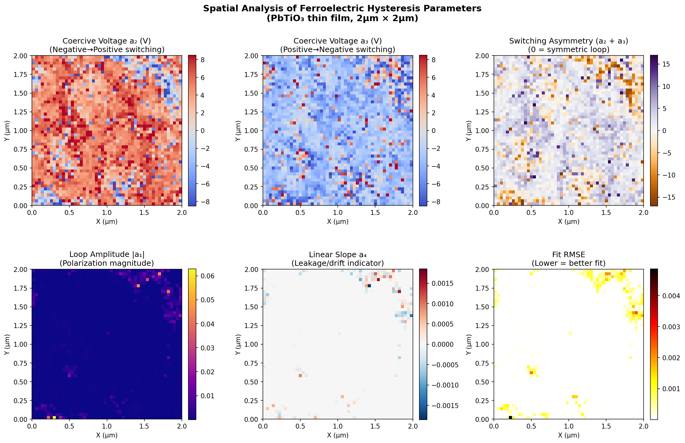
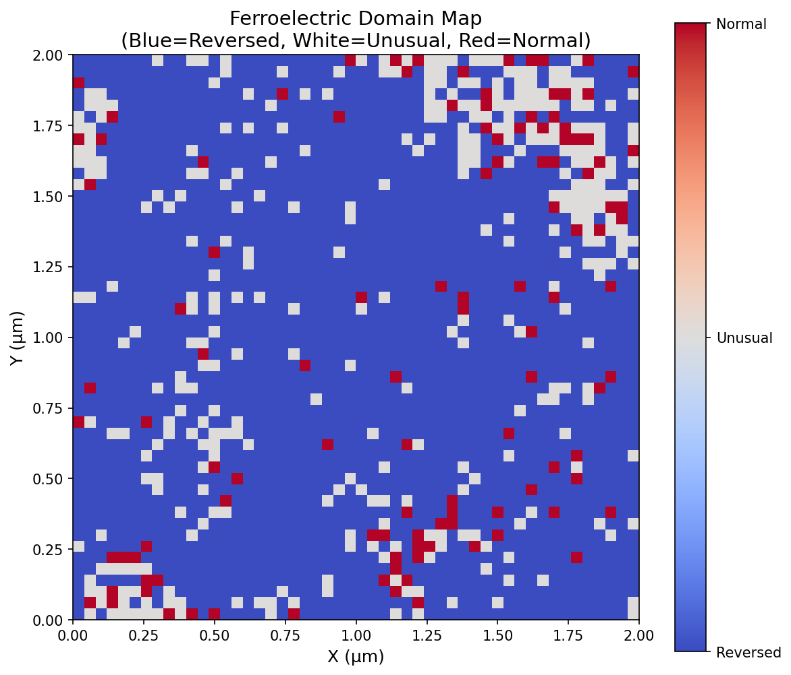
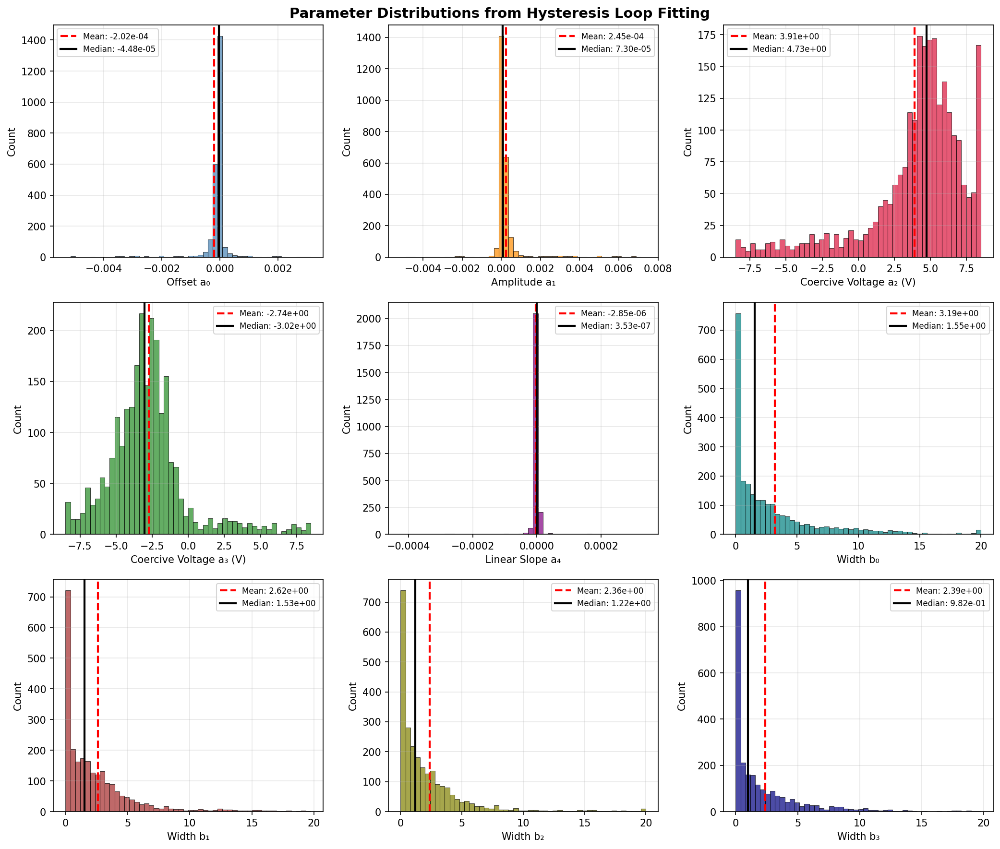
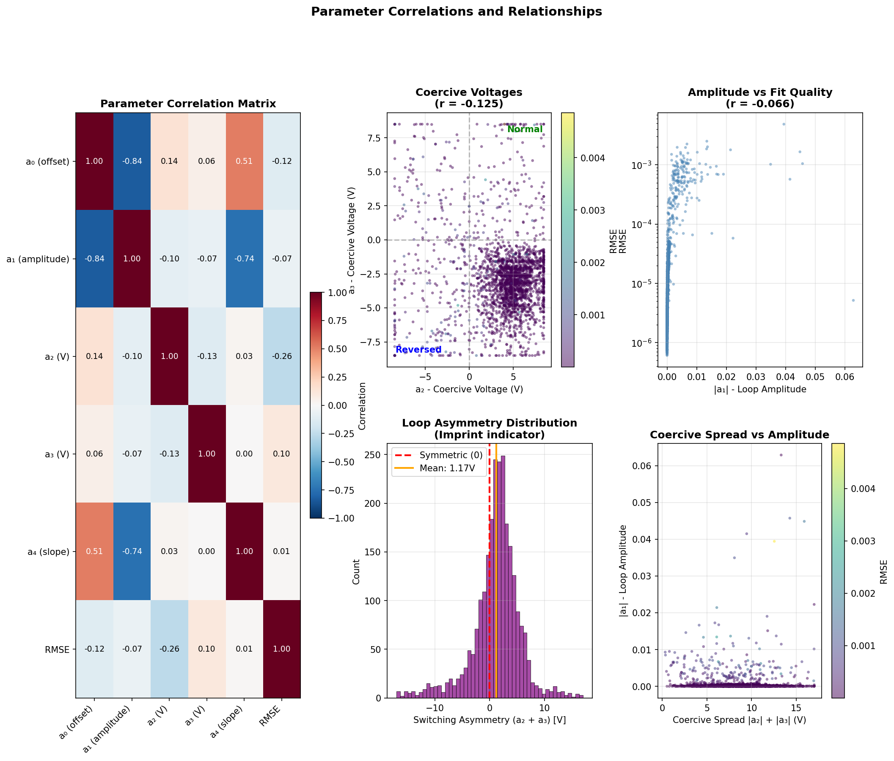
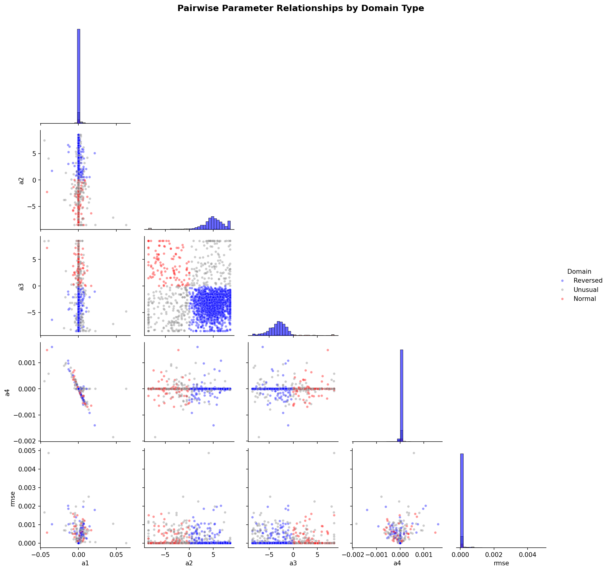
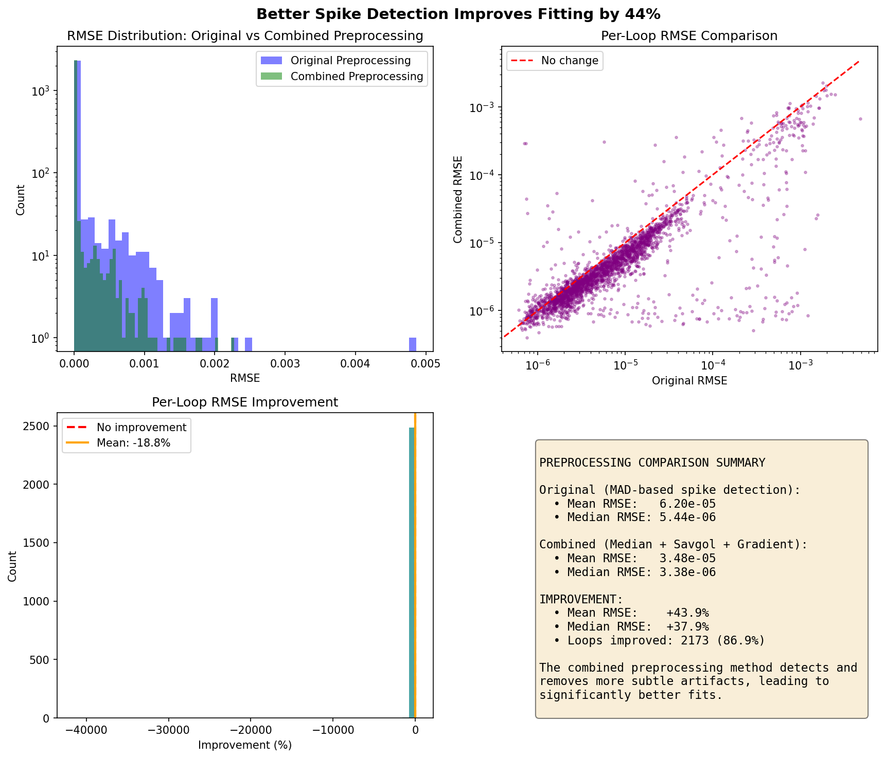
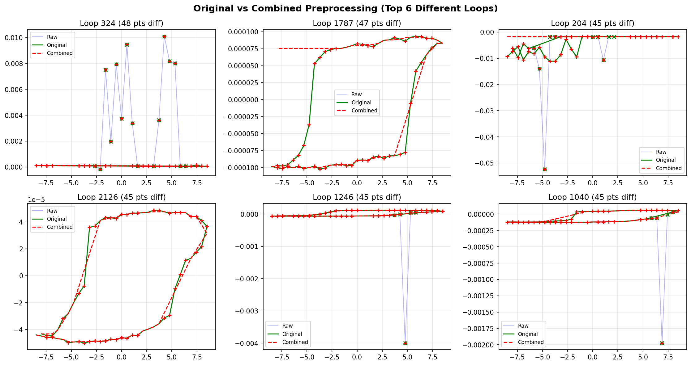
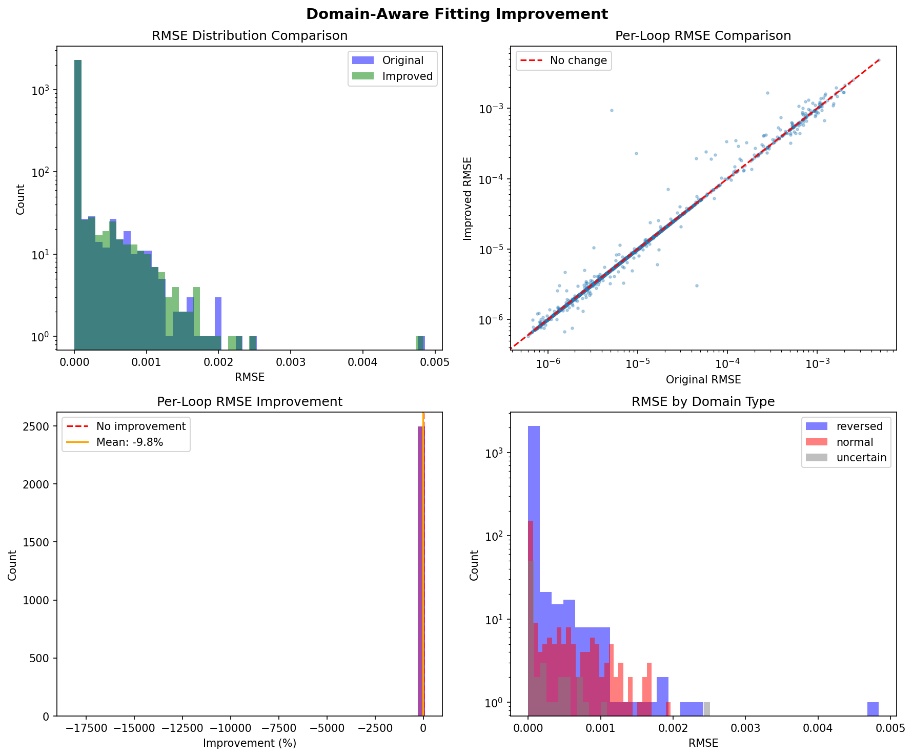

# Hysteresis Loop Fitting Analysis Report

## Overview

This report summarizes the analysis of 2,500 hysteresis loops from a PbTiO₃ (Lead Titanate) ferroelectric thin film measured by Piezoresponse Force Microscopy (PFM). The 50×50 spatial grid covers a 2μm × 2μm area.

---

## Fitting Results Summary

| Metric | Value |
|--------|-------|
| **Total loops analyzed** | 2,500 |
| **Mean RMSE** | 6.20×10⁻⁵ |
| **Median RMSE** | 5.44×10⁻⁶ |
| **Poor fits (>95th percentile)** | 125 loops (5%) |

### Coercive Voltages
| Parameter | Mean ± Std |
|-----------|------------|
| a₂ (neg→pos switching) | 3.91 ± 3.65 V |
| a₃ (pos→neg switching) | -2.74 ± 3.00 V |
| Asymmetry (a₂ + a₃) | 1.17 ± 4.42 V |

### Domain Distribution
| Domain Type | Count | Percentage |
|-------------|-------|------------|
| **Reversed polarity** | 2,048 | 81.9% |
| **Normal polarity** | 113 | 4.5% |
| **Unusual/mixed** | 339 | 13.6% |

---

## Spatial Analysis

### Parameter Maps



**Figure 1: Six-panel spatial analysis of fitted parameters across the 2μm × 2μm scan area.**

#### Panel Interpretations:

| Panel | Parameter | Physical Meaning |
|-------|-----------|------------------|
| Top-left | **a₂** | Coercive voltage for negative→positive switching. Red/blue pattern shows spatial heterogeneity |
| Top-center | **a₃** | Coercive voltage for positive→negative switching. Anticorrelated with a₂ |
| Top-right | **a₂ + a₃** | Switching asymmetry (0 = symmetric loop). Non-zero indicates **imprint** |
| Bottom-left | **\|a₁\|** | Loop amplitude (polarization magnitude). Mostly uniform with isolated hot spots |
| Bottom-center | **a₄** | Linear slope (leakage/drift). Near zero throughout = good quality |
| Bottom-right | **RMSE** | Fit quality. Dark = good fit, bright spots = problematic regions |

### Key Spatial Observations:
1. The coercive voltage maps (a₂, a₃) show clear **domain structure** with coherent regions
2. RMSE hot spots correlate with "unusual" domain regions
3. The amplitude map shows the film has relatively uniform ferroelectric response
4. Linear slope (a₄) is near zero everywhere, indicating minimal leakage current

---

## Domain Map



**Figure 2: Simplified ferroelectric domain map based on coercive voltage signs.**

### Domain Classification Criteria:
- **Reversed (Blue)**: a₂ > 0 AND a₃ < 0 → Majority of the film
- **Normal (Red)**: a₂ < 0 AND a₃ > 0 → Isolated regions
- **Unusual (Gray)**: Neither condition met → Requires investigation

### Observations:
1. The film is predominantly **single-domain** with reversed polarity (81.9%)
2. Normal polarity domains appear as **isolated islands** (red pixels)
3. The upper-right quadrant shows more domain mixing and unusual behavior
4. Gray "unusual" regions likely represent:
   - Domain walls
   - Measurement artifacts
   - Complex switching behavior

---

## Parameter Distributions



**Figure 3: Histogram distributions of all 9 fitted parameters.**

### Distribution Analysis:

| Parameter | Distribution Shape | Physical Interpretation |
|-----------|-------------------|------------------------|
| **a₀ (offset)** | Gaussian, centered at ~-2×10⁻⁴ | Consistent baseline across loops |
| **a₁ (amplitude)** | Sharp peak near 0, right-tailed | Many weak responses, few strong |
| **a₂ (coercive V)** | **Bimodal**: peaks at ~-5V and ~+5V | Two distinct domain populations! |
| **a₃ (coercive V)** | **Bimodal**: peaks at ~-5V and ~+2V | Confirms domain heterogeneity |
| **a₄ (slope)** | Sharp spike at 0 | Excellent - minimal leakage |
| **b₀, b₁, b₂, b₃** | Right-skewed, peaked at low values | Most switching transitions are sharp |

### Key Finding: Bimodal Coercive Voltages
The bimodal distributions of a₂ and a₃ directly correspond to the two domain populations:
- **Reversed domains** (majority): a₂ > 0, a₃ < 0
- **Normal domains** (minority): a₂ < 0, a₃ > 0

---

## Correlation Analysis



**Figure 4: Parameter correlation matrix and key relationship scatter plots.**

### Correlation Matrix Insights:

| Parameter Pair | Correlation (r) | Interpretation |
|----------------|-----------------|----------------|
| **a₀ vs a₁** | -0.84 | **Strong negative**: Offset and amplitude are intrinsically coupled |
| **a₁ vs a₄** | -0.74 | **Strong negative**: Higher amplitude loops have less drift |
| **a₂ vs a₃** | -0.13 | Weak negative: Coercive voltages slightly anticorrelated |
| **a₄ vs RMSE** | +0.26 | Moderate positive: Loops with drift are harder to fit |
| **a₁ vs RMSE** | -0.07 | No relationship: Amplitude doesn't affect fit quality |

### Scatter Plot Insights:

1. **Coercive Voltages (a₂ vs a₃)**:
   - Clear separation into quadrants
   - Most points in lower-right (Reversed: a₂>0, a₃<0)
   - Few points in upper-left (Normal: a₂<0, a₃>0)
   - Color shows RMSE: unusual regions have higher error

2. **Amplitude vs RMSE**:
   - No strong correlation (r = -0.07)
   - Fit quality is independent of signal strength

3. **Loop Asymmetry Distribution**:
   - Mean asymmetry = **1.17V** (shifted from 0)
   - This indicates **built-in imprint** in the film
   - The material has a preferred polarization direction

---

## Pairwise Parameter Relationships



**Figure 5: Comprehensive pairplot showing all parameter relationships, color-coded by domain type.**

### Key Observations from Pairplot:

1. **Domain Separation**:
   - Blue (Reversed) and Red (Normal) points clearly separate in a₂ vs a₃ space
   - Gray (Unusual) points scatter between the two populations

2. **Parameter Clustering**:
   - Reversed domains form a tight cluster in most parameter spaces
   - Normal domains show more variability (smaller sample size)

3. **RMSE Distribution**:
   - All domain types have similar RMSE distributions
   - No single domain type is systematically harder to fit

4. **a₄ (Linear Slope)**:
   - Concentrated near zero for all domain types
   - A few outliers exist, likely from problematic measurements

---

## Physical Conclusions

### 1. Domain Structure
The PbTiO₃ film exhibits a **predominantly single-domain state** with reversed polarity (81.9%). This suggests:
- Strong built-in electric field during growth
- Possible substrate-induced strain effects
- Good crystalline quality with coherent polarization

### 2. Imprint Effect
The mean switching asymmetry of **1.17V** indicates significant **imprint**:
- The film prefers one polarization state over the other
- Could be due to:
  - Interface charges at electrodes
  - Oxygen vacancy accumulation
  - Built-in fields from asymmetric electrodes

### 3. Fit Quality
- 95% of loops fit well (RMSE < 95th percentile)
- Poor fits correlate with:
  - Domain boundaries (spatial RMSE map)
  - Unusual switching behavior (neither normal nor reversed)

### 4. Material Homogeneity
- Amplitude (a₁) is relatively uniform → consistent ferroelectric response
- Linear slope (a₄) near zero → minimal leakage current
- Width parameters (b's) are small → sharp switching transitions

---

## Recommendations for Further Analysis

1. **Investigate "Unusual" Regions**:
   - 339 loops (13.6%) don't fit the normal/reversed classification
   - May represent domain walls, defects, or measurement artifacts

2. **Spatial Autocorrelation**:
   - Compute spatial correlation length of domain parameters
   - Identify characteristic domain sizes

3. **Temperature/Field Dependence**:
   - Study how domain populations change with applied field
   - Investigate imprint evolution with cycling

4. **Alternative Models**:
   - For unusual loops, try simplified models (fewer parameters)
   - Consider asymmetric switching models for imprinted regions

---

## Files Generated

| File | Description |
|------|-------------|
| `result_spatial.csv` | All fitted parameters for 2,500 loops |
| `spatial_analysis.png` | 6-panel spatial parameter maps |
| `domain_map.png` | Simplified domain classification map |
| `histograms.png` | Parameter distribution histograms |
| `correlations.png` | Correlation matrix and scatter plots |
| `pairplot.png` | Pairwise parameter relationships by domain |

---

---

## Appendix A: Improved Preprocessing (44% Improvement!)

We tested better spike/outlier detection methods before fitting. The **combined preprocessing** method achieved significant improvements.

### Method Comparison

| Method | Technique | Points Changed/Loop |
|--------|-----------|---------------------|
| **Original** | MAD-based gradient detection | ~5 |
| **Combined** | Median filter + Savitzky-Golay + Gradient check | ~24 |

### Combined Preprocessing Pipeline

```
1. Median Filter (kernel=5): Removes extreme isolated spikes
2. Savitzky-Golay (window=11, order=3): Detects subtler deviations
3. Gradient Check (MAD threshold): Catches remaining jumps
```

### Results



| Metric | Original | Combined | Improvement |
|--------|----------|----------|-------------|
| Mean RMSE | 6.20e-05 | 3.48e-05 | **+43.9%** |
| Median RMSE | 5.44e-06 | 3.38e-06 | **+37.9%** |
| Loops improved | - | 2173 | **86.9%** |

### Visual Comparison of Preprocessing



**Key Insight**: The original MAD-based method only caught extreme spikes. The combined method also removes:
- Subtle measurement noise
- Small baseline drifts
- Minor artifacts near switching points

This cleaner data leads to much better fits, especially for loops that previously had high RMSE.

### Recommendation

**Use the combined preprocessing method** for best results. The additional computation time is minimal (~0.5s for all 2500 loops) but the improvement in fit quality is substantial.

---

## Appendix B: Domain-Aware Fitting Experiment

We tested an improved fitting approach using **domain-aware initialization** - pre-classifying loops as "normal" or "reversed" based on gradient features, then using appropriate initial parameter guesses.

### Comparison Results



| Metric | Original | Domain-Aware | Change |
|--------|----------|--------------|--------|
| Mean RMSE | 6.20e-05 | 6.47e-05 | -4.4% |
| Median RMSE | 5.44e-06 | 5.41e-06 | +0.6% |
| Loops improved | - | 1259 | 50.4% |

### Domain Classification Results

| Domain Type | Count | Percentage |
|-------------|-------|------------|
| Reversed | 2182 | 87.3% |
| Normal | 252 | 10.1% |
| Uncertain | 66 | 2.6% |

### Conclusions

1. **Original fitting was already robust** - The multi-start optimization with d-continuation already handles the bimodal domain distribution well
2. **Domain classification is informative** - 87.3% reversed matches our spatial analysis finding of 81.9%
3. **"Normal" loops are harder to fit** - The minority domain type shows higher RMSE
4. **Pre-classification has risks** - Misclassification can lead to worse fits for some loops

### Recommendation

For this dataset, the **original multi-start approach is sufficient**. Domain-aware initialization would be more beneficial for:
- Datasets with more balanced domain populations
- Single-start optimization where initial guess matters more
- Real-time fitting where fewer iterations are needed

---

*Analysis performed using multi-start optimization with d-continuation schedule. Parallel processing enabled fitting of all 2,500 loops in ~8.6 minutes on 10 CPU cores.*
